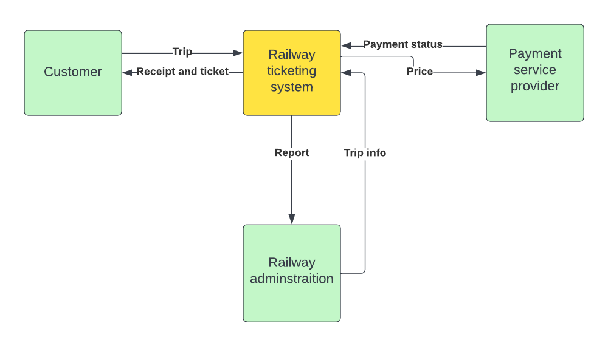
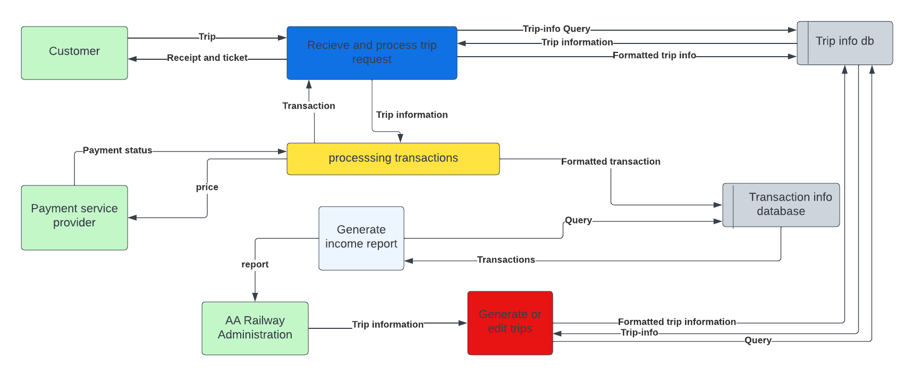
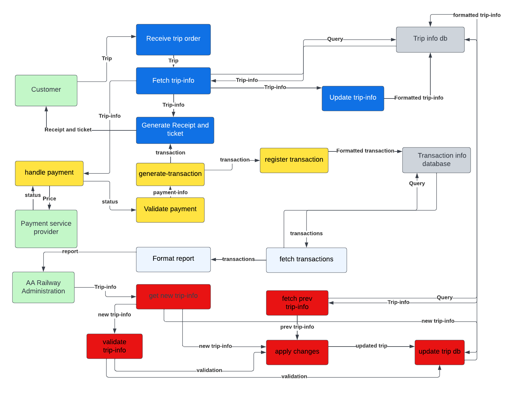
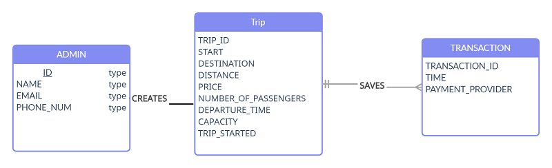

# Railway-ticketing-system
 ## 1	Preliminary Investigation/Project Plan
     1.1	Introduction and Background
Railway ticketing system is designed to make the process of booking train tickets easier and more efficient. It is a computerized system developed to support the services of rail transportation. This system helps passengers in different ways, such as providing purchasing of tickets, monitoring seats availability and many more. The main purpose of this system is to provide effective and faster ticket management for travel operators, railway departments, as well as allowing customers to purchase tickets electronically.
This system also has several advantages over traditional methods like reducing wait time in queues, eliminating manual errors, fast amendment and cancellations of existing orders etc. Moreover this helps in keeping track of passenger’s details like names, contact information or other important documents etc which allows users to access these information easily whenever needed. As this system automates almost everything it makes the process easier for both travel operators as well as for the customers making it an ideal option for onboarding new customers across various platforms like online website or mobile application.
    
    1.2	Overview of the Current System 
        
The current railway ticketing system is a paper-based ticketing system in which passengers must purchase tickets from ticket sellers on the train. The system is not used in many countries, but is still in use in some countries, such as the Ethiopia.

    1.3	Problem/Opportunity Statement
 
### The railway ticketing system offers a variety of advantages. These include the following:

   - Improved Security: The railway ticketing system allows for improved security as customers can book their tickets securely and without worry. This is due to its use of encryption technology to ensure personal information stays secure during the process. 

   - Increased Customer Satisfaction: With the digital ticketing system, customers have easier access to tickets and rail services with just a few clicks on their computer or smartphone's screen. This increased convenience leads to higher customer satisfaction. 

   - Automation of Services: Railway ticketing systems allow information regarding prices, routes, timetables, etc., available at all times so that customers can make informed decisions while booking tickets without relying on human interaction in-person or over telephone lines – reducing costs associated with manual labor as well as leading to faster turnaround times in terms of processing transactions. 

### Some Disadvantages include 
  
   - Overbooking of tickets: One of the biggest problems faced by the railway ticketing system is overbooking of tickets. This happens when many passengers book the same train ticket, resulting in long queues and delays in their journey. 

   - Availability of seats: Another common problem faced by the railway ticketing system is the availability of seats for passengers. Sometimes, despite having a booked ticket, passengers might not find an available seat to board their desired train as all seats on that particular train may already be taken. 

   - Cancellations & Refunds: Cancelling booked tickets and getting refunds for them is another common problem faced by customers while dealing with the railway ticketing system. Many customers tend to face a great deal of stress in order to receive refunds for their cancelled tickets - they have to wait a minimum time-frame before they can get their money back, let alone a valid refund amount. 

   - Delays & Locomotive breakdowns: Delays and locomotive breakdowns are inevitable event which often cause commuters much inconvenience and stress on daily basis trips during peak travel hours when there are too many people trying to catch the same train in a limited time frame.
        
    1.4	Objectives of the Project
The primary objective of the Railway Reservation System is to provide an efficient and streamlined way for passengers to book tickets and check seat availability. It also enables railway authorities to manage their resources effectively, reducing overcrowding on trains and providing a better customer experience. Additionally, the system allows passengers to track their ticket status, thus providing greater transparency and convenience when traveling.
   
    1.5	Significance of the Project
Railway ticketing is a system that allows passengers to buy tickets in advance of their journey, and to validate these tickets against a physical record at the       point of travel. The railway ticketing system is an important part of the railway infrastructure, and helps to ensure that passengers can travel safely and             without disruption.

    1.6	Scope of the Proposed System
The scope of a railway ticketing system encompasses all applications or processes associated with the booking, issuing, and reimbursement of train tickets. It covers features such as fare calculations, availability checking, and payment processing as well as reporting capabilities that provide insights into the performance of train ticket sales. The system may also feature various customer-facing interfaces for purchasing tickets online or through mobile apps.

    1.7	[Estimated Budget, Tool and Resource Requirements]
Estimated Budget: 
The estimated budget for a railway ticketing system would depend on a variety of factors such as the complexity of the system, how many stations are involved, how many types of tickets need to be processed and many more factors. As a general estimate, it may cost up to $1 million or more depending on the various requirements.

Tool and Resource Requirements: 
- Computing Hardware - Computers and servers will be needed to run the system. The hardware should be able to handle the workloads associated with ticket reservation, printing and reporting. It should also have enough storage capacity for collecting and storing data about transactions.
- Network Infrastructure - It will be necessary to connect all railway stations across the country or region through a dedicated high-speed network so that tickets can be reserved from any station in real time. This could include connecting points like routers, switches, etc., along with cables for data transmission so that customers can access railway services anytime and anywhere. 
- Database server - A separate database server will be required for robust storage and access of customer information as well as fare details associated with different routes. This is important for providing accurate and up-to-date information while processing ticket requests.
- Software - Ticketing software will be required to collect customer information such as name, contact details etc., find out fare rates and routes based on user selection, create itineraries/schedules, manage bookings as well generate marketing reports after every transaction process. There should also adequate security measures built-in protect customer’s confidential details from malicious attacks or unintended exposure.  In addition , there might also need automated payment gateway integrations some form of loyalty program management tools (optional).
    
      1.8	Tasks (WBS) and Schedule 
      1.9	Risk Management
Railway ticketing systems can be managed in a number of ways to reduce the risk of fraud and abuse. One approach is to use a centralized system, in which tickets are issued and managed centrally. This approach can be more secure, as tickets cannot be easily counterfeit or stolen. Another approach is to use a distributed system, in which tickets are issued and managed by the individual stations along the railway network. This approach can be more flexible, as stations can vary in their ticketing policies and procedures. Finally, a hybrid system can be used, in which some elements of a centralized system are used, while other elements are implemented using a distributed system.
      
      1.10	Communication Plan
  ## 2	System Analysis

      2.1	Requirements Determination
The requirement determination process for Railway Reservation System involves collecting information from different sources to determine the functional and non-functional requirements of the system. Sources of information relevant to the system include customer feedback, interviews with stakeholders, existing documentation, industry standards, and market research. Additionally, the requirements can also be determined based on the data requirements of the organization and the business objectives.

      2.1.1	Functional requirements 
The functional requirements of a Railway Reservation System include the ability to book tickets, save transactions, generate transaction report to management, add additional trips and edit existing ones. Additionally, the system should also be able to generate reports, process payments, and provide customer support. Other requirements include the ability to handle multiple currencies, generate invoices, and provide integration with other systems.

      2.1.2	Non-functional requirements 
The non-functional requirements of a Railway Reservation System include security, scalability, reliability, maintainability, availability, and usability. Security requirements should ensure that information is securely stored and that customer data is protected from unauthorized access. Scalability requirements should ensure that the system is able to handle an increasing number of users and transactions. Reliability requirements should ensure that the system is able to handle large amounts of data and transactions without failure. Maintainability requirements should ensure that the system is easily maintainable and can be upgraded with minimal disruption. Availability requirements should ensure that the system is accessible to customers at all times. Finally, usability requirements should ensure that the system is easy to use for customers.

    2.2	Requirements Structuring
      2.2.1	Process modeling using DFD (describe your entire DFD, starting from Context Diagram all the way down to the Primitive DFD)
 ## Zero-Level diagram
This is the Zero Level DFD of Railway Reservation System, where we have eloborated the high level process of Railway Reservation. It's a basic overview of the whole Railway Reservation System or process being analyzed or modeled. This diagram shows the interaction of the system with the customers, the adminstrators and payment service providers

  
  
 ## First-Level diagram
 First Level DFD of Railway Reservation System shows how the system is divided into sub-systems(processes), each of which deals with one or more of the data flows to or from an external agent, and which together provide all of the functionality of the Railway Reservation System system as a whole. Here we break down the one large system at the level-0 diagram to 4 different components
        
	  1. Receive and process trip requests: This step entails getting the request from the customer, creating the ticket for the customer, and other related tasks.
          2. processing transaction: This step entails managing payments and recording completed transactions on databases.
          3. Generate a report: This entails generating a report for management.
	  4. Generate/Edit Trip: This entails introducing new Trips to the System as well as having the ability to Edit Existing Trips.
 
  
 
 ## Second-Level diagram
  DFD level 2 then goes one step deeper into parts of Level 1 of Railway Reservation. It may require more functionalities of Railway Reservation to reach the necessary level of detail about the Railway Reservation functioning. First Level DFD of Railway Reservation System shows how the system is divided into sub-systems(processes). The 2nd Level DFD contains more details of Payment, Customer, Train Route, Train Shedule, Ticket, Booking, Trains.
  
  
  
      2.2.2	Logic Modeling 
```
Receive trip order
if trip is valid:
	fetch the trip from database:
		if trip exists in database:
			make api request to payment service provider
			if the payment is successful:
				generate transaction
				generate ticket and receipt
				update the number-of-passengers and other trip info
				write the trip-info to the database
			else
				give the message to the user
		else
			give the message to the user
else
	give the the message to the user
```

      2.2.3	Conceptual Data Modeling using ER Model
        2.2.3.1	Entity Types, Attributes and Relationships of the System
        2.2.3.2	ER Diagram
The ER diagram of a railway ticketing system typically contains entities such as Admin, Trip and Transaction, among others. The entities are linked to one another through relationships such as one-to-one, one-to-many, and many-to-many. The one-to-one relationship is used to link a passenger to their login credentials, while the one-to-many relationship is used to link a passenger to their tickets. The many-to-many relationship is used to link different tickets to different trains. 

  
        
## 3	System Design
    3.1	Database design
Database design for railway ticketing system involves the implementation of the data model that was developed during the conceptual design phase. This is done by creating the database structure, specifying the data types and sizes, setting up indexes and other constraints, and creating relationships between the entities. The database design should also ensure that the data is secure and accessible by authorized personnel only. Additionally, it should also be optimized for better performance and scalability. This can include the use of partitioning and replication technologies, as well as the implementation of monitoring and backup processes.

      3.1.1	Logical database design
Logical database design for a railway ticketing system involves the implementation of the data model that was developed during the conceptual design phase. This is done by creating the database structure, specifying the data types and sizes, setting up indexes and other constraints, and creating relationships between the entities. The logical database design should also ensure that the data is secure and accessible by authorized personnel only. Additionally, it should also be optimized for better performance and scalability. This can include the use of partitioning and replication technologies, as well as the implementation of monitoring and backup processes.
 


      3.1.2	Physical database design
Physical database design for railway ticketing system involves the implementation of the data model that was developed during the conceptual design. This is done by creating the database structure, specifying the data types and sizes, setting up indexes and other constraints, and creating relationships between the entities. The physical database design is also responsible for the optimization of the database for better performance and scalability. This can include the use of partitioning and replication technologies, as well as the implementation of monitoring and backup processes.
      
```sql
CREATE TABLE TRIP (
    TRIP_ID INT NOT NULL,
    START VARCHAR(50) NOT NULL,
    DESTINATION VARCHAR(50) NOT NULL,
    DISTANCE INT NOT NULL,
    PRICE INT NOT NULL,
    NUMBER_PF_PASSENGERS INT NOT NULL,
    DEPARTURE_TIME TIME NOT NULL,
    ADMIN VARCHAR(50) NOT NULL,
    PRIMARY KEY (TRIP_ID),
    FOREIGN KEY (ADMIN) REFERENCES ADMIN(ADMIN_ID)
);

CREATE TABLE ADMIN (
    ADMIN_ID VARCHAR(50) NOT NULL,
    NAME VARCHAR(50) NOT NULL,
    EMAIL VARCHAR(50) NOT NULL,
    PHONE_NUM VARCHAR(50) NOT NULL,
    PRIMARY KEY (ADMIN_ID)
);

CREATE TABLE TRANSACTION (
    TRANSACTION_ID INT NOT NULL,
    TRIP_ID INT NOT NULL,
    TIME TIME NOT NULL,
    PAYMENT_PROVIDER VARCHAR(50) NOT NULL,
    PRIMARY KEY (TRANSACTION_ID),
    FOREIGN KEY (TRIP_ID) REFERENCES TRIP(TRIP_ID)
);
```
    3.2	Interface design
When designing an interface for a railway ticketing system, it is important to create a user-friendly experience for customers. Design elements should make it easy for customers to search for trains, view availability, and book tickets. The interface should include elements such as a search bar, a list of available trains, and an easy-to-use booking form. Additionally, the interface should be visually appealing and adhere to the principles of good design. The interface should be easy to navigate, with clear labels and buttons, and provide helpful feedback to the user when necessary. Finally, the interface should be optimized for various devices, including mobile and desktop, to ensure a consistent user experience across platforms.

      3.2.1	Forms and reports Design
      
When designing forms and reports for a railway ticketing system, it is important to consider the user experience of customers. Forms should be easy to use and should provide helpful feedback to the user when necessary. Reports should be designed to be visually appealing, organized in a way that makes it easy to interpret the data, and should provide useful information to the users. Additionally, the forms and reports should also be optimized for various devices, including mobile and desktop, to ensure a consistent user experience across platforms.
       
       
       
       
       
       
       
      3.2.2	Dialogue Design
When designing a dialogue system for a railway ticketing system, the goal should be to create a conversational experience that is natural and easy to use. The system should be able to understand user input, provide relevant and contextual information about the train journeys, and guide users through the booking process. The dialogue should be designed to be accessible and inclusive for all users, regardless of age, gender, language, or ability. Additionally, the dialogue should also be optimized for various devices, including mobile and desktop, to ensure a consistent user experience across platforms. Finally, it should also be designed to provide helpful feedback to the user when necessary, and provide an easy way for users to change or cancel their bookings


## 4	System implementation 
    4.1	Application development
The development of this system requires building two different applications. The first application is for clients to use the system and book a trip. The second application is for admins and management.
The development methodology that we’re going to follow is agile scrum methodology. 
According to scrum methodology we’ll break the application down into smaller manageable components and use an iterative process to develop each components.
When developing this program, we’ll divide it into different parts. This will allow us to use different programming languages and tools which are the best for the given task.
The client side of the application development is designed to be a mobile application. involves developing the front-end and backend-part. The front-end part can be done by scripting languages and communicates with the front-end using API calls. Since the backend-part part involves a lot of interactions with other systems it needs to be written using a high-performance programming language. So, it’s implemented using a compiled programming language.
The other application is the managing application. Since this application is a desktop application and also needs fast interactions with the backend system it’s written in a language similar to the backend part.

    4.2	Testing
When developing this system testing is given huge attention.
Several integration tests are written for front-end parts of both systems. Unit tests are written for both the front-end and back-end parts. In addition to the two tests Security, Stress and Other tests are written for the backend part.

    4.3	Installation
The client-side application will be published on different mobile application stores. The clients can then directly install the application on their phones.
The other application will require a more careful attention. It’ll be installed by a person with the necessary knowledge. The system. will directly be installed for the first time. And, subsequent installations will be done in parallel to the previous system.

## 5	Conclusion and Recommendation

Based on the analysis of the existing railway ticketing system, it can be concluded that the current system is inadequate and does not provide a smooth and efficient user experience. Therefore, it is recommended that the system be upgraded to provide a more efficient user experience.The system should be optimized for better performance and scalability, as well as ensuring security and data privacy. Finally, it is also recommended that a monitoring and backup system be implemented to ensure that the system is always running optimally.
